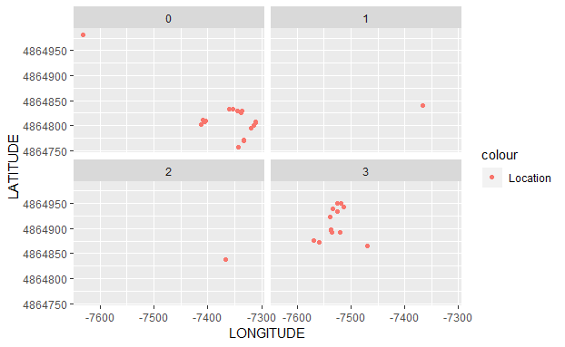
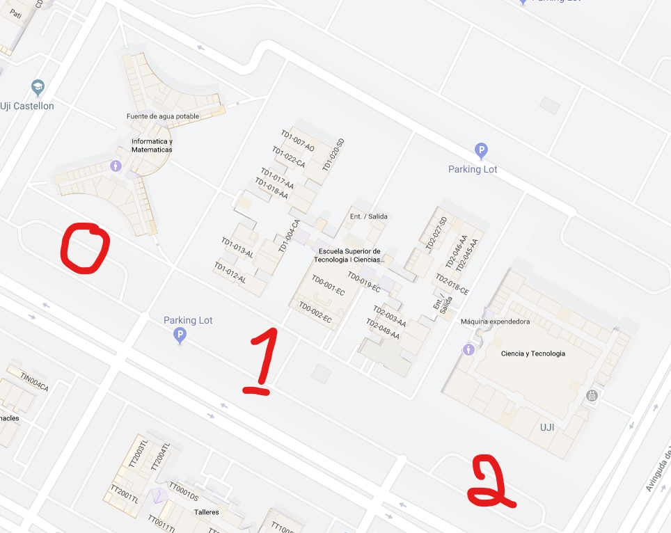
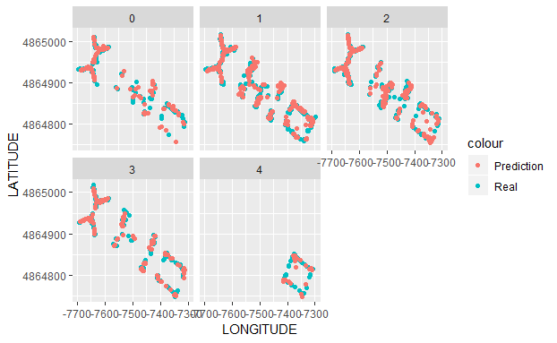

# Evaluate-Techniques-for-Wifi-Localization
Using the UJIIndoorLoc DataSet  to define best strategies and models for Wi-Fi Localization

The data was taken from http://archive.ics.uci.edu/ml/datasets/UJIIndoorLoc

## Objective 
Find the best models to predict the localization of the user using the Wi-Fi strength.

## The Data 

The Data used is "The UJIIndoorLoc is a Multi-Building Multi-Floor indoor localization database to test Indoor Positioning System that relies on WLAN/WiFi fingerprint."

The localization is the Institute of New Imaging Technologies, Universitat Jaume I, Avda. Vicente Sos Baynat S/N, 12071, Castellón, Spain

The data consist of 21048 instances with 529 variables described as:

*Attribute 001 (WAP001)*: Intensity value for WAP001. Negative integer values from -104 to 0 and +100. Positive value 100 used if WAP001 was not detected. 

.... 

*Attribute 520 (WAP520)*: Intensity value for WAP520. Negative integer values from -104 to 0 and +100. Positive Value 100 used if WAP520 was not detected. 

*Attribute 521 (Longitude)*: Longitude. Negative real values from -7695.9387549299299000 to -7299.786516730871000 

*Attribute 522 (Latitude)*: Latitude. Positive real values from 4864745.7450159714 to 4865017.3646842018. 

*Attribute 523 (Floor)*: Altitude in floors inside the building. Integer values from 0 to 4. 

*Attribute 524 (BuildingID)*: ID to identify the building. Measures were taken in three different buildings. Categorical integer values from 0 to 2. 

*Attribute 525 (SpaceID)*: Internal ID number to identify the Space (office, corridor, classroom) where the capture was taken. Categorical integer values. 

*Attribute 526 (RelativePosition)*: the Relative position with respect to Space (1 - Inside, 2 - Outside in Front of the door). Categorical integer values. 

*Attribute 527 (UserID)*: User identifier (see below). Categorical integer values. 

*Attribute 528 (PhoneID)*: Android device identifier (see below). Categorical integer values. 

*Attribute 529 (Timestamp)*: UNIX Time when the capture was taken. Integer value. 

Divided into two data sets one for training and another for validation.

all of that plus the method to produce the data is further explained in the article: *Joaquín Torres-Sospedra, Raúl Montoliu, Adolfo Martínez-Usó, Tomar J. Arnau, Joan P. Avariento, Mauri Benedito-Bordonau, Joaquín Huerta 
UJIIndoorLoc: A New Multi-building and Multi-floor Database for WLAN Fingerprint-based Indoor Localization Problems 
In Proceedings of the Fifth International Conference on Indoor Positioning and Indoor Navigation, 2014.*

## The pre-process 

In the data provided, there were some instances that degraded the quality of the Data. 
1. duplicate instances where the same user at the same time was making different fingerprints for the training set. 
2. WAPS were not consistent in the full-time frame, some WAPS where changed between the months of the projects.
3. The strength of the Wi-Fi is not constant and change in different conditions from the height of the user and phone system to walls and amount of people around. 

To solve these problems and guarantee the quality of the training set.

* The duplicates were removed.

* A list of the WAPS that were working in the Validation set was done and I used this list to remove all the WAPS that were out of service from the Training data set.

* After I scaled the signals from 0 no signal to 1 better signal in the row, I did that to take out the variations of the Wi-Fis.

Also, I took out all the instances without a signal, real localization that for some reason the Wi-Fi system did not reach. 

### Insight from that 
This process was necessary because of the Problems of Wi-Fi fingerprint method of Localization.

It depends on WAPS, that with time change places and break, constructions or changes in the furniture will interfere with the precision too.
That means that the models have an expiration date if they were not actualized the will be of less precision after some time. 

Still, the advantages make for that.
You don't need to buy special hardware and can use the system already instaled in cell phones and buildings, no extra charge involved.

Another issue is that exist places where there was no Wi-Fi signal, this information could be useful to make decisions of where to instal new WAPS 

### "Spots Without Signal"

## Predict the building 

I tried 3 different algorithms to predict the building c(knn, ranger, gbm).
Knn and gbm got me the best results with 100% to predict of witch building the user is, on the Validation set. 

|                    |  KNN  |  Ranger  |  gbm  |
|--------------------|-------|----------|-------|
| Building           | 1.000 |  0.9982  | 1.000 |    

With this result, I used the predictions to create a Dataset for each one of the buildings.

### Predicting the floors 

#### Bulding 0

To accelerate the time to do the model I exclude all the WAPS that had no signal because they only exist in the buildings 1 and 2.

On the building 0 

I used 3 algorithms to predict the floors c(knn, ranger, gbm).

|                    |  KNN  |  Ranger  |  gbm  |
|--------------------|-------|----------|-------|
| Building0 floors   | 0.9664|  0.9757  | 0.9615| 
|--------------------|-------|----------|-------|
| Floor       0      | 0.9359|  0.9615  | 0.9646|
| Floor       1      | 0.9760|  0.9904  | 0.9856|
| Floor       2      | 0.9636|  0.9758  | 0.9333|
| Floor       3      | 0.9765|  0.9529  | 0.9765|
|--------------------|-------|----------|-------|

#### Bulding 1

To accelerate the time to do the model I exclude all the WAPS that had no signal because they only exist in the buildings 0 and 2.

On the building 1 I notice that he has an extra characteristic from the other two buildings, it has more open spaces, because of that exist some signals that invade the building that comes from the other two buildings. and from different floors of the building.
to solve that Issue only used the strong signals to make the prediction and this had improved for this specific building the predictions. 

I used 3 algorithms to predict the floors c(knn, ranger, gbm).

|                    |  KNN  |  Ranger  |  gbm  |
|--------------------|-------|----------|-------|
| Building1 floors   | 0.9251|  0.6221  | 0.7785| 
|--------------------|-------|----------|-------|
| Floor       0      | 0.7667|  0.5000  | 0.7666|
| Floor       1      | 0.9371|  0.5664  | 0.6993|
| Floor       2      | 0.9310|  0.6667  | 0.8391|
| Floor       3      | 0.9787|  0.7872  | 0.9149|
|--------------------|-------|----------|-------|

As is possible to see the Knn has a better result but the ground floor has a not a good accuracy because of the characteristics of the building.

#### Bulding 2

To accelerate the time to do the model I exclude all the WAPS that had no signal because they only exist in the buildings 0 and 1.

On the building 2. 

I used 3 algorithms to predict the floors c(knn, ranger, gbm).

|                    |  KNN  |  Ranger  |  gbm  |
|--------------------|-------|----------|-------|
| Building0 floors   | 0.9403|  0.9478  | 0.9515| 
|--------------------|-------|----------|-------|
| Floor       0      | 0.9166|  0.9166  | 0.9166|
| Floor       1      | 0.9820|  0.9820  | 0.9820|
| Floor       2      | 0.8889|  0.9444  | 0.9630|
| Floor       3      | 0.9750|  0.9750  | 0.9750|
| Floor       4      | 0.8718|  0.8462  | 0.8462|
|--------------------|-------|----------|-------|

this building has a different characteristic first has a 4 floor and the other buildings did not have. 
Second during the training set, a portion of the 4th floor was not accessible what make the predictions for this floor, less accurate.

## Results of building floor prediction on the validation set 

My final find is that different buildings have a better result with different models, depending on the structure of the building, and when I choose the model depending on the building I get the best possible results. 

|                    |  KNN  |  Ranger  |  gbm  | Best  |
|--------------------|-------|----------|-------|-------|
| Building           | 1.000 |  0.9982  | 1.000 | 1.0000| 
|--------------------|-------|----------|-------|-------|
| Floor              | 0.9487|  0.8695  | 0.9100| 0.9559|
|--------------------|-------|----------|-------|-------|
| Floor       0      | 0.8939|  0.8485  | 0.9091| 0.9091|
| Floor       1      | 0.9654|  0.8571  | 0.8961| 0.9719|
| Floor       2      | 0.9412|  0.8758  | 0.9118| 0.9608|
| Floor       3      | 0.9767|  0.9128  | 0.9593| 0.9651|
| Floor       4      | 0.8718|  0.8462  | 0.8462| 0.8462|

### Longitude and Latitude Predictions 

At the lest I did the same preprocess to predict the Longitude and Latitude, meaning that in the building one I cancel most of the week signals to have only WAPS in relation to the building 1.
And with Knn I got a mean distance error of: 

# |      Mean distance error       |  Maximum distance error  |
# |  ---------  7.966 m --------   | -------  68.072 m ------ |

The maximum distance error related to the wrong floor predictions.

The biggest error of prediction comes from the ground floor and the 4th floor where we would need more WAPS to have a better prediction and probably a more accurate fingerprint.  